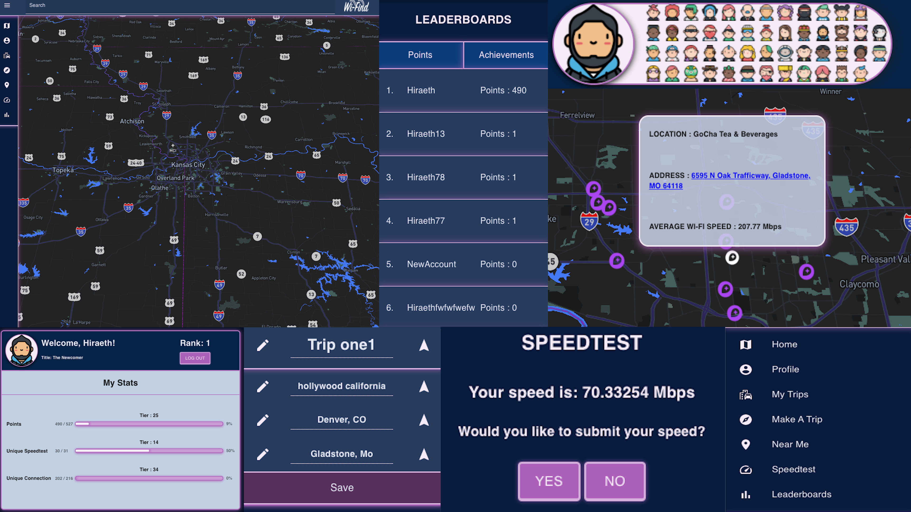

# Wi-Find

## Disclaimer - Due to CORS blocks the live deployment is not fully functional. I am working on a resolve for the issue.

## Description

_Duration: 2 Week Sprint_

Wi-Find is Free Public Wi-Fi locator application. With the increase of remote work working from home every single day can begin to come dry, and the easiest way to change up the scenery is by heading to a local coffee shop.

Not everyone knows which coffee shops or even any local provides access to free public wi-fi, but Wi-Find with help from the user base will automatically populate these locations whenever users run a new speedtest for the location, allowing other users to see any location along with their average wi-fi speed.

To see the fully functional site, please visit: [Wi-Find](http://wi-find.herokuapp.com/#/home)

## Screen Shots

### Prerequisites

Link to software that is required to install the app.

- [Node.js](https://nodejs.org/en/)

## Installation

1. Clone this repo to your local machine.
2. Open the project in the editor of your choice, we use [VS Code](https://code.visualstudio.com/) and run `npm install`.
3. The development database should populate with the data stored in the `init.sql` and `data.sql` files.\*\*
4. Once the development server has started it should serve a message to indicate the server started successfully.
5. In a browser, go to `http://localhost:3000`. You should see the application running.

6. Create a database named `prime_app`,
7. The queries in the `database.sql` file are set up to create all the necessary tables and populate the needed data to allow the application to run correctly. The project is built on [Postgres](https://www.postgresql.org/download/), so you will need to make sure to have that installed. I recommend using Postico to run those queries as that was used to create the queries,
8. Run `npm run server` in your terminal
9. Run `npm run client` in your terminal. this will open up a new browser tab for you!

## Usage

1. Register and/or Login to the application using the Login button on the landing page.
2. On the user page, click the images to read the full success story on each individual animal.
3. Click the 'Resources' tab in the navigation bar to view the list of resources provided- The user can add using the 'Add Resource' button.
4. Click the resource name to view more rescue information or edit the rescue information. Clicking 'Go Back' will return the user to return to the list.
5. Click the 'Delete' icon next to each resource to remove the resource from the list.
6. 'Log Out' tab in the navigation bar will log the user out, and send them back to the landing page.

## Built With

React,
Redux-Saga,
Express,
Node,
PostgreSQL,
HTML,
CSS,
Material-UI,
Sweet Alerts,
Mapbox API,
Speedtest API,

## License

[MIT](https://choosealicense.com/licenses/mit/)

## Acknowledgement

Thanks to [Prime Digital Academy](www.primeacademy.io) who equipped and helped me to make this application a reality.

## Support

If you have suggestions or issues, please email me at chase-dillon-simmons@gmail.com
